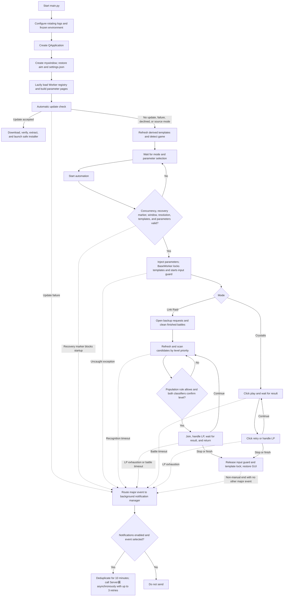

# Architecture

Language: [简体中文](./首页) · [English](./Home_EN) · [日本語](./ホーム)

## Overall structure

```text
main.py                      GUI entry and application-level task controller
src/
  click/                     Click layer
    click_action.py          Same-frame template-group matching, coordinate actions, resolution detection
    click_behavior.py        Window recognition, client motion sampling, OpenCV matching, mouse action
    template_confidence.py   Per-PNG thresholds, hot reload, and completeness validation
  workers/                   Automation worker threads
    base.py                  BaseWorker base class, retry_until, timeout constants
    registry.py              ParamSpec / WorkerMeta / @register registry
    link_raid.py             Link Raid flow
    crystalis.py             Crystalis flow
  packs/                     Template pack management
    language_switcher.py     aim junction, pack scanning/selection/validation
    image_scaler.py          Derive other-resolution templates from 2K source
    file_lock.py             Cross-process template mutex
  core/                      Application infrastructure
    app_settings.py          GUI settings persistence
    notification.py          Server酱 background delivery, retries, and deduplication
    log_setup.py             Windowed-safe console and rotating-file logging configuration
    input_activity.py        User keyboard/mouse monitoring and automation-input isolation
  update/
    update_check.py          Version checking and safe update installation
resource/                    Icons and per-PNG confidence configuration
language/                    Template pack source directories
tools/ImageMagick/           Asset scaling tool
```

## Call relationships

```text
main.py -> src/workers -> src/click/click_action -> src/click/click_behavior -> game
src/workers/base.py -> src/core/input_activity.py -> Win32 user32
main.py -> src/packs/image_scaler
main.py -> src/update/update_check
main.py / src/workers -> src/core/notification -> Server酱 API
```

## Runtime flow



## main.py

`mywindow(QWidget)` plus `LanguageSwitcherWidget`. It is the GUI entry and application-level task controller:

- Lazily builds one worker and parameter page per `WorkerMeta`; no worker class is hardcoded in the GUI
- Restores every registered parameter per Worker from `settings.json` and saves atomically as controls change
- `_start_worker()` rejects concurrent tasks, unresolved update-recovery markers, missing game windows, unknown/mismatched client resolution, incomplete required template groups, and invalid parameters; it reads GUI parameters before expanding dynamic required-template paths
- Resolution mismatch is a hard block
- The GUI has a dedicated `logging` handler with a runtime-selectable DEBUG/INFO/WARNING/ERROR/CRITICAL threshold, defaulting to INFO on new installations; the same selection controls the file handler. Worker `signal.emit` messages remain visible as INFO and are mirrored to files with a GUI-deduplication marker
- New builds use PyInstaller `--windowed` and no longer show an empty companion console; compatibility with old console-mode builds hides an existing console
- `closeEvent()` uses one shared 12-second deadline to stop/wait for workers, scaling, update checks, and update preparation
- Update signals include a task ID so stale thread results are ignored
- Frozen startup completes the automatic update check before template scaling; accepting an update keeps scaling deferred, while cancellation or failure resumes it
- Source-mode automatic checks log the Release URL; only manual checks open it
- The settings dialog manages a masked Server酱 SendKey, one or two channels, event selection, and asynchronous testing; Worker major events and update failures share the background notification manager

`main.py` does not contain Link Raid or Crystalis flow logic.

## src/workers

Automation worker threads. Mode code is independent, but only one worker can run in one GUI process; automation, scaling, and update installation are mutually exclusive.

### registry.py

`ParamSpec` describes GUI parameters and supports `choice`, `ordered_multi_choice`, `bool`, `lp_recover`, and `int`. `WorkerMeta` contains `name`, `label`, `worker_class`, `params`, `start_hint`, and `required_templates`. Required template paths are relative to the pack root and omit the `_<number>.png` suffix. Dynamic placeholders must reference a declared `ParamSpec.key`. These paths cover startup-critical groups; optional best-effort groups need not block startup.

Adding a mode requires a no-argument-constructible `BaseWorker` subclass decorated with `@register`, plus an import in `src/workers/__init__.py`.

### base.py

`BaseWorker(QThread)`, `retry_until()`, `RETRY_TIMEOUT=60`, and `BATTLE_TIMEOUT=1800`. Per-worker state is `_active` plus `_stop_event`; `start()` refuses restart while the old thread still runs and resets manual-stop and major-event tracking. GUI `stop()` explicitly records a manual stop.

During every template wait, each continuous 5-second miss triggers a 2-second observation of the game client. If more than 50% of pixels change, the activity is treated as likely battle animation and only that recovery cycle is skipped. On a stable image, the next step is checked again before a recovery click at the last safe automation position. For flows with explicitly declared next-step templates, either a normal click or a recovery click returns success only after one is recognized. Ordinary templates may be clicked redundantly while the current page remains. Fixed safe-position actions retry only after renewed recognition and within their limit, and accept no next step before the first confirmed click. The cycle continues until success, timeout, or cancellation.

Each run starts a `UserActivityGuard`. Keyboard input or cumulative large mouse movement pauses template actions until the user has been idle for 5 seconds. Bot mouse input runs inside an automation guard and therefore does not count as user activity; successful automation input also updates the last safe position.

`_run_safely()` holds the cross-process template mutex for the full worker run, rechecks `expected_pack`, handles cancellation/lock timeout/errors, and always calls `_finish()` in `finally`. Recognition/battle timeouts, exhausted recovery, and uncaught exceptions are reported to the application through `majorEvent`. A non-manual end emits `脚本自动结束` only if no other major event was reported during that run; clicking stop or closing the application emits nothing, and existing major events are never duplicated. Concrete workers must route `run()` through `_run_safely()`.

### link_raid.py

Link Raid flow: navigation, backup requests, refresh, joined-battle cleanup, ordered multi-level selection, join/LP handling, battle completion, and return. Multiple enabled levels are evaluated in user priority order; every supported level and the central number region compete at each candidate, and both classifiers must choose the same selected level. If a higher-priority level has no eligible room, the next selected level is tried immediately. A miss is rescanned before at most one downward scroll and final scan; at least 4.5 seconds separate the actual refresh click from the next automation input. Unreadable participant counts are allowed, while 9/10 and 10/10 are independently skipped or allowed. Full and already-ended join results are dismissed and rematched. After `play`, one state loop checks delayed `already_end` and normal results every 0.5 seconds. A generic `OK` is clicked once only when it and the full dialog message match together in the central region for three consecutive frames. `tap_to_countinue` confirms the result screen only from `_1/2` text outlines, clicks a scaled safe bottom-center coordinate, and permits one renewed confirmation and second click if the page remains.

### crystalis.py

Crystalis flow. It first performs a scaled 2K-baseline wake-up click at `(2000,1000)`, then loops `click_play -> wait_win -> click_retry_or_recover_lp`.

## src/click

### click_action.py

Collects contiguous numbered template variants, compares a group against one shared frame, and selects only the global highest score. Multiple next-step groups can share a frame; fixed-coordinate actions can restrict detection variants and separate recognition from the click position. It also provides raw/scaled coordinate actions and tolerant client-resolution detection.

### click_behavior.py

Window lookup/focus, visible game-window capture, OpenCV matching, client-only motion sampling, and mouse action. Template reads, Gaussian blur, and text-foreground masks are cached by file signature, while one screenshot can serve multiple groups. Normal matching applies the same 3x3 Gaussian blur to screenshot and templates. Text mode uses locally adaptive screen binarization and an Otsu template mask, applies the same 7x7 Gaussian blur to both outlines, and constrains `TM_SQDIFF_NORMED` with three pixels of negative space to tolerate resolution rasterization without accepting plain bright areas. Mouse clicks record a monotonic timestamp, and worker-scheduled earliest-input deadlines are checked immediately before the next mouse input so recognition and processing time naturally count toward the interval. Recognition and recovery sampling use only the game client, which must remain visible and unobstructed.

### template_confidence.py

Parses and hot-reloads `resource/template_confidence.txt`. The highest-scoring candidate uses its own PNG threshold; Link Raid's full-image and level-number winners resolve thresholds independently. Missing, duplicate, malformed, or out-of-range entries reject recognition instead of falling back to a global value. Task startup verifies that every PNG in the active pack resolves to a threshold.

## src/packs

### language_switcher.py

`aim/` junction, pack scanning/selection, labels, `active.json`, complete PNG validation, and required-template validation. Complete validation uses Pillow in addition to the standard library.

### image_scaler.py

Uses ImageMagick Triangle filtering to derive 720p/1080p/4K packs from each 2560x1440 source. The current recipe is version 2, which invalidates output from older recipes. Skip requires matching source SHA-256, recipe/tool fingerprint, and target SHA-256. Cleanup normally removes only files managed by a valid old manifest. Exact paths in the retired-official-template migration list are removed from source and derived packs even when an old manifest is missing, while unrelated untracked files remain untouched.

### file_lock.py

Repository-specific `Global\\` Windows mutex shared by switching, scaling, worker runtime leases, update-lock recovery, and the installer.

## src/update/update_check.py

Prerelease-aware update checking and frozen-app updating. Reading remains compatible with one unique `MagiaExedra_auto_<tag>.zip` or `MagiaExedra_auto_<tag>_win64.zip`; new releases must use `_win64`. Automatic install requires GitHub SHA-256, cancellable size/hash-checked download, safe bounded extraction, AMD64 PE validation, backups, hash verification, rollback/recovery markers, and startup-health handshake.

## src/core

### log_setup.py

Stdlib-only logging configuration called once at `main.py` import, before `QApplication`. When stderr exists, the console defaults to WARNING and `MAGIA_LOG_LEVEL` can override it; `--windowed` builds safely skip a missing console. Before business imports, the file handler reads `settings.json`, defaults to INFO for new installations, and follows the GUI selector. Worker `signal.emit` messages still display directly in the GUI and are mirrored as `magia.runtime` INFO records with a deduplication marker. Pillow inherits the selected log level, so per-PNG-block diagnostics remain available at DEBUG. Retention defaults to seven days, supports 1-365 days, and startup removes only strictly named expired Magia logs while retaining the active log family.

### app_settings.py

Atomically persists automation mode, every Worker's registered parameters, log settings, and Server酱 configuration to root `settings.json`. Stamina recovery stores the visible count. The SendKey exists in plaintext only in this Git-ignored local file. Channel lists are normalized to one or two entries, retaining the first two from stale over-limit settings.

### notification.py

Stdlib-only structured major-event delivery to the fixed Server酱 SendKey API. Channels come from an official allowlist, with one or two allowed in one request. Delivery runs on background threads, retries failures up to three times with increasing delays, and deduplicates identical events for ten minutes. Logs and errors never include the SendKey.

### input_activity.py

Uses Windows `ctypes` to monitor keyboard and mouse activity. Keyboard input or cumulative large mouse movement pauses automation until the user has been idle for 5 seconds. PyAutoGUI operations use a guard context, so the bot's own movements and clicks do not trigger the pause.

> This page is an AI translation and may contain ambiguities or inaccuracies. For authoritative content, refer to the [简体中文 Wiki](./项目架构).
