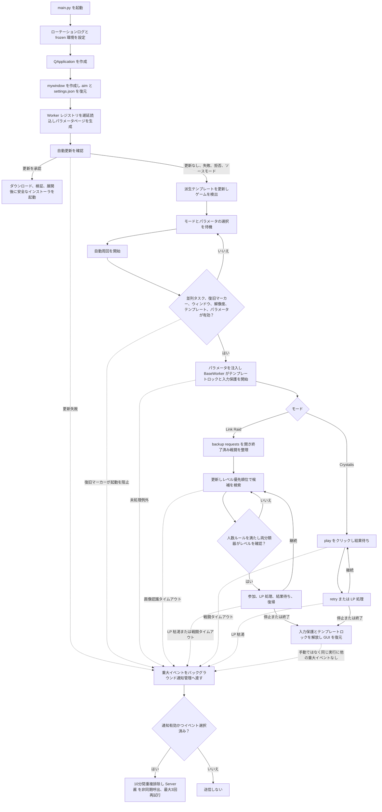

# アーキテクチャ

言語：[简体中文](./首页) · [English](./Home_EN) · [日本語](./ホーム)

## 全体構成

```text
main.py                      GUI エントリとアプリレベルのタスクコントローラ
src/
  click/                     クリック層
    click_action.py          同一フレームでのテンプレートグループ照合、座標アクション、解像度検出
    click_behavior.py        ウィンドウ画像認識、クライアント動体サンプリング、OpenCV マッチング、マウス操作
    template_confidence.py   PNG ごとのしきい値、ホットリロード、完全性検証
  workers/                   自動周回ワーカースレッド
    base.py                  BaseWorker 基底クラス、retry_until、タイムアウト定数
    registry.py              ParamSpec / WorkerMeta / @register レジストリ
    link_raid.py             Link Raid フロー
    crystalis.py             Crystalis フロー
  packs/                     テンプレート pack 管理
    language_switcher.py     aim ジャンクション、pack スキャン/選択/検証
    image_scaler.py          2K ソースから他解像度テンプレートを派生
    file_lock.py             プロセス間テンプレートミューテックス
  core/                      アプリ基盤
    app_settings.py          GUI 設定の永続化
    notification.py          Server酱 のバックグラウンド送信、再試行、重複排除
    log_setup.py             windowed 対応のコンソールおよびローテーションファイルログ設定
    input_activity.py        ユーザーのキーボード/マウス監視と自動操作入力の分離
  update/
    update_check.py          バージョン確認と安全な更新インストール
resource/                    アイコンと PNG ごとの信頼度設定
language/                    テンプレート pack ソースディレクトリ
tools/ImageMagick/           素材スケーリングツール
```

## 呼び出し関係

```text
main.py -> src/workers -> src/click/click_action -> src/click/click_behavior -> game
src/workers/base.py -> src/core/input_activity.py -> Win32 user32
main.py -> src/packs/image_scaler
main.py -> src/update/update_check
main.py / src/workers -> src/core/notification -> Server酱 API
```

## 実行フロー



## main.py

`mywindow(QWidget)` と `LanguageSwitcherWidget`。GUI エントリでありアプリレベルのタスクコントローラです：

- 各 `WorkerMeta` に対して worker とパラメータページを遅延構築します。GUI に worker クラスはハードコードされていません
- `settings.json` から Worker ごとの全登録パラメータを復元し、コントロール変更時に即座にアトミック保存します
- `_start_worker()` は並列タスク、未解決の更新リカバリマーカー、ゲームウィンドウの欠落、未知/不一致のクライアント解像度、不完全な必須テンプレートグループ、無効なパラメータを拒否します。GUI パラメータを読み取ってから動的な必須テンプレートパスを展開します
- 解像度の不一致はハードブロックです
- GUI には専用の `logging` ハンドラがあり、DEBUG/INFO/WARNING/ERROR/CRITICAL を実行時に切り替えられます。新規インストールは INFO がデフォルトで、同じ選択がファイルハンドラにも適用されます。worker の `signal.emit` は INFO として常に表示され、GUI 重複防止マーカー付きでファイルへミラーされます
- 新しいビルドは PyInstaller の `--windowed` を使用するため空のコンソールが併設されません。旧 console モードとの互換動作では既存のコンソールを非表示にします
- `closeEvent()` は1つの共有12秒期限で workers、スケーリング、更新確認、更新準備を停止/待機します
- 更新シグナルにはタスク ID が含まれ、古いスレッドの結果は無視されます
- frozen 起動時は自動更新チェックを完了してからテンプレートをスケーリングし、更新承認中はスケーリングを延期したまま、キャンセルまたは失敗後に再開します
- ソースモードの自動確認は Release URL のみを記録し、手動確認のみがそれを開きます
- 設定画面でマスク表示の Server酱 SendKey、1～2個のチャネル、イベント、非同期テストを管理し、Worker の重大イベントと更新失敗を共通の通知マネージャーへ渡します

`main.py` には Link Raid や Crystalis のフローロジックは含まれません。

## src/workers

自動周回ワーカースレッド。モードごとにコードは独立していますが、1つの GUI プロセスで実行できる worker は1つだけです。自動化、スケーリング、更新インストールは相互排他です。

### registry.py

`ParamSpec` は GUI パラメータを記述し、`choice`、`ordered_multi_choice`、`bool`、`lp_recover`、`int` をサポートします。`WorkerMeta` は `name`、`label`、`worker_class`、`params`、`start_hint`、`required_templates` を含みます。必須テンプレートパスは pack ルートからの相対パスで、`_<number>.png` 接尾辞を省略します。動的プレースホルダは宣言済みの `ParamSpec.key` を参照する必要があります。これらは起動に重要なグループをカバーし、オプションのベストエフォートグループは起動をブロックしません。

新モードの追加には、`@register` でデコレートされた引数なしで構築可能な `BaseWorker` サブクラスと、`src/workers/__init__.py` へのインポート1行が必要です。

### base.py

`BaseWorker(QThread)`、`retry_until()`、`RETRY_TIMEOUT=60`、`BATTLE_TIMEOUT=1800`。各 worker の状態は `_active` と `_stop_event` です。`start()` は旧スレッドがまだ実行中の場合は再起動を拒否し、手動停止と重大イベントの記録をリセットします。GUI の `stop()` は手動停止を明示的に記録します。

テンプレート待機では、連続して 5 秒見つからないたびにゲームのクライアント領域を 2 秒間観察します。変化したピクセルが 50% を超える場合は戦闘アニメーションの可能性が高いとみなし、その回のリカバリだけをスキップします。安定画面では次ステップを再確認し、まだ進んでいない場合だけ最後の安全な自動操作位置へ復旧クリックします。次ステップが明示されたフローは、その認識後に成功を返します。通常テンプレートは現在画面が残る間に冗長クリックする場合があります。固定安全座標アクションは再認識後に上限内でだけ再試行し、最初の確認済みクリック前には次ステップを受け入れません。成功、タイムアウト、キャンセルまで周期を継続します。

各実行で `UserActivityGuard` を開始します。キーボード入力または累積した大きなマウス移動を検出するとテンプレート操作を一時停止し、ユーザーが 5 秒間操作しなければ再開します。bot のマウス入力は自動操作 guard 内で行われるためユーザー操作として数えられず、成功した自動操作後には最後の安全位置も更新されます。

`_run_safely()` は worker 実行全体でプロセス間テンプレートミューテックスを保持し、`expected_pack` を再確認し、キャンセル/ロックタイムアウト/エラーを処理し、`finally` で常に `_finish()` を呼び出します。画像認識/戦闘タイムアウト、回復回数枯渇、未処理例外は `majorEvent` でアプリ層へ報告します。手動ではなく、同じ実行で他の重大イベントがなければ `脚本自动结束` を1回送信します。停止クリックやアプリ終了では送信せず、既存の重大イベントにも重複しません。具象 worker は `run()` を `_run_safely()` 経由でルーティングする必要があります。

### link_raid.py

Link Raid フロー：ナビゲーション、backup requests、更新、参加済み戦闘の整理、優先順位付き複数レベル選択、参加/LP 処理、戦闘完了、復帰。選択した複数レベルをユーザー優先順位で評価し、各候補位置では全対応レベルと中央数字領域を比較して、両分類器が同じ選択済みレベルを選んだ場合だけ採用します。上位レベルに参加可能な部屋がなければ次の選択済みレベルを直ちに試します。最初の検索で見つからない場合は再検索してから下方向へ最大1回だけスクロールし、最後に検索します。更新の実クリックから次の自動入力まで最低4.5秒を確保します。人数を読めない候補は許可し、9/10 と 10/10 は独立設定でスキップまたは許可します。満員/終了済みの参加結果は閉じて再検索します。`play` 後は1つの状態ループが遅延 `already_end` と通常結果を0.5秒ごとに確認し、完全なダイアログ文字と汎用 `OK` が中央領域で3フレーム連続して同時に一致した場合だけ1回クリックします。`tap_to_countinue` は `_1/2` の文字輪郭だけで結果画面を確認し、スケーリングした画面下中央の安全座標をクリックします。画面が残る場合は再確認後にもう1回までクリックします。

### crystalis.py

Crystalis フロー。最初にスケーリングされた 2K 基準のウェイクアップクリック `(2000,1000)` を実行し、その後 `click_play -> wait_win -> click_retry_or_recover_lp` をループします。

## src/click

### click_action.py

連番のテンプレートバリエーションを収集し、同じフレーム上でグループ最高スコアだけを選択します。複数の次ステップグループは 1 フレームを共有でき、固定座標アクションは検出バリエーションを限定して認識位置とクリック位置を分離できます。生/スケーリング座標アクションと、許容誤差のあるクライアント解像度検出も提供します。

### click_behavior.py

ウィンドウ検索/フォーカス、可視ゲームウィンドウのキャプチャ、OpenCV マッチング、クライアント領域のみの動体サンプリング、マウス操作を担当します。テンプレート読込、Gaussian Blur、文字前景マスクをファイル署名でキャッシュし、1 枚のスクリーンショットを複数グループで共有できます。通常照合は画面とテンプレートへ同じ 3x3 Gaussian Blur を適用します。文字モードは画面を局所適応二値化し、テンプレートには Otsu マスクを使い、両方の輪郭へ同じ 7x7 Gaussian Blur を適用します。さらに3ピクセルの負空間で `TM_SQDIFF_NORMED` を制約し、解像度ごとのラスタライズ差を許容しながら単純な明部を除外します。マウスクリックは単調時刻を記録し、worker が設定した最早入力期限を次のマウス入力直前に確認するため、その間の認識と処理時間も間隔に含まれます。認識と復旧サンプリングはゲームクライアントだけを対象にし、画面は可視・非遮蔽である必要があります。

### template_confidence.py

`resource/template_confidence.txt` を解析し、保存後にホットリロードします。最高スコア候補は自身の PNG しきい値を使用し、Link Raid の全体画像とレベル数字の勝者も別々に解決します。欠落、重複、不正形式、範囲外の設定はグローバル値へフォールバックせず認識を拒否します。タスク開始前に、アクティブ pack の全 PNG にしきい値があることを検証します。

## src/packs

### language_switcher.py

`aim/` ジャンクション、pack スキャン/選択、ラベル、`active.json`、完全な PNG 検証、必須テンプレート検証。完全検証は標準ライブラリに加えて Pillow を使用します。

### image_scaler.py

ImageMagick の Triangle フィルタを使い、各 2560x1440 ソースから 720p/1080p/4K pack を派生します。現在のレシピは v2 で、旧レシピの生成物は無効になります。スキップ条件はソース SHA-256、レシピ/ツールフィンガープリント、ターゲット SHA-256 のすべてが一致することです。通常のクリーンアップは有効な旧 manifest で管理されたファイルだけを削除します。公式の廃止テンプレート移行リストにある正確なパスは、旧 manifest がなくてもソース pack と派生 pack から削除し、それ以外の未登録ファイルは保持します。

### file_lock.py

リポジトリ固有の `Global\\` Windows ミューテックス。切り替え、スケーリング、worker 実行時リース、更新ロックリカバリ、インストーラで共有されます。

## src/update/update_check.py

プレリリース対応の更新確認と frozen アプリの更新。読み取りは1つのユニークな `MagiaExedra_auto_<tag>.zip` または `MagiaExedra_auto_<tag>_win64.zip` と互換性を維持します。新リリースは `_win64` を使用する必要があります。自動インストールには GitHub SHA-256、キャンセル可能なサイズ/ハッシュチェック付きダウンロード、安全な境界付き展開、AMD64 PE 検証、バックアップ、ハッシュ検証、ロールバック/リカバリマーカー、起動ヘルスハンドシェイクが必要です。

## src/core

### log_setup.py

標準ライブラリのみに依存するログ設定モジュールで、`main.py` のインポート時、`QApplication` の前に1回呼び出されます。stderr がある場合、コンソールはデフォルト WARNING で、`MAGIA_LOG_LEVEL` により上書きできます。`--windowed` でコンソールがない場合は安全に省略します。ファイルハンドラは業務モジュールの前に `settings.json` を読み、新規インストールは INFO がデフォルトで、GUI 選択に追従します。worker の `signal.emit` は GUI に直接表示しつつ、重複防止マーカー付きの `magia.runtime` INFO としてファイルへミラーします。Pillow は選択したログレベルを継承するため、DEBUG では PNG ブロック診断も残ります。保持期間はデフォルト7日、1～365日に対応し、起動時に厳密な名前の期限切れ Magia ログだけを削除して現在のログ族を保持します。

### app_settings.py

自動周回モード、Worker ごとの全登録パラメータ、ログ設定、Server酱 設定をルートの `settings.json` に原子的に保存します。体力回復は GUI 表示回数を保存し、SendKey の平文は Git 対象外のこのローカルファイルだけに存在します。チャネルは1～2個に正規化し、旧設定が上限超過なら先頭2個を保持します。

### notification.py

標準ライブラリのみで、固定の Server酱 SendKey API へ構造化した重大イベントを送信します。公式ホワイトリストから1回のリクエストに1～2個のチャネルを指定できます。バックグラウンドスレッドで送信し、失敗時は待機を増やしながら最大3回再試行し、同一イベントを10分間重複排除します。ログとエラーに SendKey を含めません。

### input_activity.py

Windows の `ctypes` でキーボードとマウスの操作を監視します。キーボード入力または累積した大きなマウス移動で自動化を一時停止し、ユーザーが 5 秒間操作しなければ再開します。PyAutoGUI 操作は guard コンテキスト内で行うため、bot 自身の移動やクリックでは一時停止しません。

> このページは AI による翻訳であり、曖昧さや不正確な箇所が含まれる可能性があります。正確な情報は [简体中文 Wiki](./项目架构) を参照してください。
