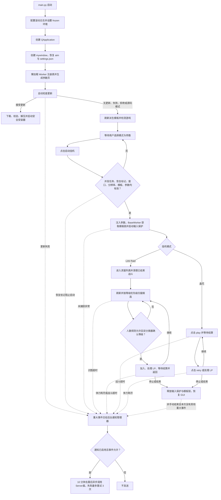

# 项目架构

语言：[简体中文](./首页) · [English](./Home_EN) · [日本語](./ホーム)

## 总体结构

```text
main.py                      GUI 入口与应用级任务控制器
src/
  click/                     点击层
    click_action.py          同帧模板组匹配、坐标动作、分辨率检测
    click_behavior.py        窗口识图、客户区动态采样、OpenCV 匹配、鼠标动作
    template_confidence.py   逐 PNG 阈值配置、热重载与完整性校验
  workers/                   挂机工作线程
    base.py                  BaseWorker 基类、retry_until、超时常量
    registry.py              ParamSpec / WorkerMeta / @register 注册表
    link_raid.py             Link Raid 流程
    crystalis.py             晶花流程
  packs/                     模板包管理
    language_switcher.py     aim 联接、pack 扫描/选择/校验
    image_scaler.py          从 2K 源派生其它分辨率模板
    file_lock.py             跨进程模板互斥量
  core/                      应用基础设施
    app_settings.py          GUI 设置持久化
    notification.py          Server酱 后台推送、重试与去重
    log_setup.py             windowed 安全的控制台与滚动文件日志配置
    input_activity.py        用户键鼠活动监控与自动化输入隔离
  update/
    update_check.py          版本检查与安全更新安装
resource/                    图标与逐 PNG 置信度配置
language/                    模板包源目录
tools/ImageMagick/           素材缩放工具
```

## 调用关系

```text
main.py -> src/workers -> src/click/click_action -> src/click/click_behavior -> game
src/workers/base.py -> src/core/input_activity.py -> Win32 user32
main.py -> src/packs/image_scaler
main.py -> src/update/update_check
main.py / src/workers -> src/core/notification -> Server酱 API
```

## 脚本运行流程



## main.py

`mywindow(QWidget)` 加 `LanguageSwitcherWidget`。它是 GUI 入口和应用级任务控制器：

- 为每个 `WorkerMeta` 惰性构建一个 worker 和参数页，GUI 不硬编码任何 worker 类
- 从 `settings.json` 恢复每个 Worker 的全部注册参数，并在控件变化后立即原子保存
- `_start_worker()` 拒绝并发任务、未解决的更新恢复标记、缺失游戏窗口、未知/不匹配的客户区分辨率、不完整的必需模板组以及无效参数；它先读取 GUI 参数，再展开动态必需模板路径
- 分辨率不匹配是硬性阻断
- GUI 增加独立的 `logging` handler 和可运行时切换的 DEBUG/INFO/WARNING/ERROR/CRITICAL 等级，新安装默认 INFO；同一选择同步控制文件 handler。worker 的 `signal.emit` 用户消息在 GUI 中始终以 INFO 显示，并通过去重标记镜像到文件日志
- 新构建使用 PyInstaller `--windowed`，不再伴随空控制台窗口；兼容旧 console 模式时会隐藏已有控制台
- `closeEvent()` 用一个共享的 12 秒期限停止/等待 workers、缩放、更新检查和更新准备
- 更新信号带任务 ID，过期的线程结果会被忽略
- frozen 模式启动时先完成自动更新检查，再启动模板缩放；接受更新时保持缩放延后，取消或失败后恢复缩放
- 源码模式自动检查只记录 Release URL，只有手动检查才打开它
- 设置窗口管理遮蔽的 Server酱 SendKey、1-2 个通道、事件开关和异步测试；Worker 重大事件与更新失败统一交给后台通知管理器

`main.py` 不包含 Link Raid 或晶花的流程逻辑。

## src/workers

挂机模式的工作线程。模式间代码独立，但一个 GUI 进程只能运行一个 worker；自动化、缩放和更新安装互斥。

### registry.py

`ParamSpec` 描述 GUI 参数，支持 `choice`、`ordered_multi_choice`、`bool`、`lp_recover` 和 `int`。`WorkerMeta` 包含 `name`、`label`、`worker_class`、`params`、`start_hint` 和 `required_templates`。必需模板路径相对于 pack 根，且省略 `_<number>.png` 后缀；动态占位符必须引用已声明的 `ParamSpec.key`。这些路径覆盖启动关键组，可选的尽力而为组不会阻断启动。

新增模式需要一个无参数可构造的 `BaseWorker` 子类，用 `@register` 装饰，并在 `src/workers/__init__.py` 中加一行 import。

### base.py

`BaseWorker(QThread)`，提供 `retry_until()`、`RETRY_TIMEOUT=60` 和 `BATTLE_TIMEOUT=1800`。每个 worker 的状态是 `_active` 加 `_stop_event`；`start()` 在旧线程仍在运行时拒绝重启，并重置手动停止与重大事件记录。GUI 的 `stop()` 会显式标记手动停止。

每次等待模板时，每连续未命中 5 秒就观察游戏客户区 2 秒。变化像素超过 50% 时视为战斗动画，仅跳过本轮恢复；画面稳定时先重新检查下一步，仍未推进才在最后一个安全自动化位置执行恢复点击。对于明确声明了下一步模板的流程，正常点击或恢复点击后都必须先识别到下一步才返回成功；普通模板在当前页面仍存在时可冗余点击。固定安全坐标动作只在重新识别后按上限重试，且首次确认点击前不接受下一步。之后继续按 5 秒周期等待，直到成功、超时或取消。

每次运行都会启动 `UserActivityGuard`。检测到用户键盘输入或累计较大的鼠标移动后，模板动作暂停，连续空闲 5 秒才恢复；bot 自己的鼠标输入位于自动化 guard 中，不会被计为用户活动。所有自动化输入还会在成功后更新最后安全位置。

`_run_safely()` 在整个 worker 运行期间持有跨进程模板互斥量，重新检查 `expected_pack`，处理取消/锁超时/错误，并在 `finally` 中始终调用 `_finish()`。识图/战斗超时、体力恢复耗尽和未捕获异常通过 `majorEvent` 上报应用层；非手动结束且本次没有其他重大事件时补发一次“脚本自动结束”。点击停止或关闭程序不推送，也不会在已有重大事件后重复推送。具体 worker 必须通过 `_run_safely()` 路由 `run()`。

### link_raid.py

Link Raid 流程：导航、求援请求、刷新、已加入战斗清理、有序多等级选择、加入/LP 处理、战斗完成和返回。等级选择按用户优先级处理多个已选等级，在同一候选附近比较全部支持等级，并独立比较中央等级数字区域；两个分类器必须选择同一已选等级。高优先级没有合格房间时立即尝试下一已选等级。初扫未找到等级或 `no_lv` 时先复扫，再至多下滑一次并最终扫描；刷新点击到后续自动化输入至少间隔 4.5 秒。人数无法确认时允许尝试，9/10 与 10/10 分别按独立设置跳过或允许；加入时的满员/已结束提示会关闭后重新匹配。点击 `play` 后的统一状态循环每 0.5 秒同时检查延迟 `already_end` 和正常结算；通用 `OK` 只有与完整弹窗文字在中央区域连续三帧同帧命中时才单击。`tap_to_countinue` 只使用 `_1/2` 的文字轮廓确认结算页，再点击缩放的底部中央安全坐标，页面未推进时最多重新确认并点击一次。初始导航和滚动使用缩放的 2K 基准坐标。

### crystalis.py

晶花流程。先执行一次缩放的 2K 基准唤醒点击 `(2000,1000)`，然后循环 `click_play -> wait_win -> click_retry_or_recover_lp`。

## src/click

### click_action.py

收集连续编号的模板变体，用同一帧比较整组，并且只选择全组中得分最高的候选进行查找或点击。多个下一步组可共用一帧；固定坐标动作可以限定检测变体并把识图位置与点击位置分离。同时提供原始/缩放坐标动作和容错的客户区分辨率检测。

### click_behavior.py

窗口查找/聚焦、可见游戏窗口截图、OpenCV 匹配、客户区动态采样和鼠标动作。模板读取、Gaussian Blur 与文字前景掩码按文件签名缓存；同一截图可供多组模板复用。普通匹配对截图与模板应用相同的 3x3 Gaussian Blur；文字模式对画面使用局部自适应二值化、对模板使用 Otsu 掩码，再以相同的 7x7 Gaussian Blur 柔化轮廓，并用三像素负空间约束 `TM_SQDIFF_NORMED`，兼顾不同分辨率栅格差异与亮区误报。鼠标点击会记录单调时钟时间戳，worker 设置的最早输入截止点在下一次鼠标输入前检查，因此两次输入之间的识别和处理耗时会自然计入间隔。模板识图和动态恢复检测只采样游戏客户区。游戏必须保持可见且不被遮挡。

### template_confidence.py

解析并热重载 `resource/template_confidence.txt`。每次只用模板组最高分候选自身的阈值；Link Raid 等级整图与数字区域候选分别读取各自 PNG 阈值。配置缺失、重复、格式错误或超出 0.0-1.0 时拒绝识别，不回退到全局值。启动挂机前会确认当前 pack 的每张 PNG 都能解析到阈值。

## src/packs

### language_switcher.py

`aim/` 联接、pack 扫描/选择、标签、`active.json`、完整 PNG 校验和必需模板校验。完整校验除标准库外还使用 Pillow。

### image_scaler.py

从每个 2560x1440 源使用 ImageMagick Triangle 滤镜派生 720p/1080p/4K pack。当前配方版本为 v2；旧配方生成物会失效。跳过条件是源 SHA-256、配方/工具指纹和目标 SHA-256 全部匹配。通常只清理由有效旧 manifest 管理的文件；官方退役模板迁移清单中的精确路径即使缺少旧 manifest，也会从源 pack 和派生 pack 清除，其它未登记文件保持不动。

### file_lock.py

仓库专用的 `Global\\` Windows 互斥量，由切换、缩放、worker 运行期租约、更新锁恢复和安装器共用。

## src/update/update_check.py

支持预发布感知的更新检查和 frozen 应用的更新。读取仍兼容唯一的 `MagiaExedra_auto_<tag>.zip` 或 `MagiaExedra_auto_<tag>_win64.zip`；新发布必须使用 `_win64`。自动安装要求 GitHub SHA-256、可取消的大小/哈希校验下载、安全有界解压、AMD64 PE 校验、备份、哈希验证、回滚/恢复标记和启动健康握手。

## src/core

### log_setup.py

只依赖标准库的日志配置模块，在 `main.py` 导入期、`QApplication` 之前调用一次。有 stderr 时，控制台 handler 默认 WARNING，环境变量 `MAGIA_LOG_LEVEL` 可覆盖其等级；`--windowed` 构建没有 stderr 时会安全跳过。文件 handler 在业务模块导入前读取 `settings.json`，新安装默认 INFO，并随 GUI 选择器同步调整。worker 的 `signal.emit` 仍直接显示到 GUI，同时以 `magia.runtime` INFO 记录镜像到文件并通过标记避免 GUI 重复。Pillow 继承用户选择的日志等级，因此 DEBUG 模式会保留逐 PNG 块诊断。日志默认保留 7 天、支持 1-365 天，启动时自动清理严格命名的过期 Magia 日志并保留当前会话日志族。

### app_settings.py

将挂机模式、每个 Worker 的全部注册参数、日志设置和 Server酱 配置原子写入根目录 `settings.json`。体力药保存用户看到的次数；SendKey 明文只存在这个被 Git 忽略的本地文件中；通道列表规范为 1-2 个，旧超限配置保留前两个。

### notification.py

只依赖标准库，向固定的 Server酱 SendKey API 发送结构化重大事件。通道使用官方白名单，一次请求允许 1-2 个；发送在线程中执行，失败递增等待并最多重试 3 次，相同事件 10 分钟内去重。日志和错误反馈不会包含 SendKey。

### input_activity.py

通过 Windows `ctypes` 监控键盘和鼠标活动。键盘输入或累计较大的鼠标移动会暂停自动化，连续 5 秒无用户活动后恢复。PyAutoGUI 自动化操作使用 guard 上下文，因此 bot 自己的移动和点击不会触发暂停。
